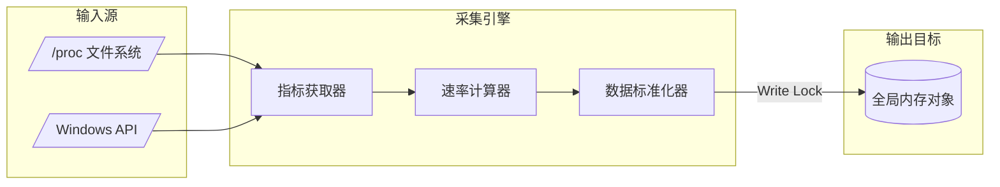
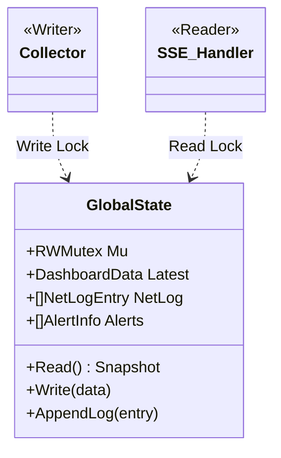
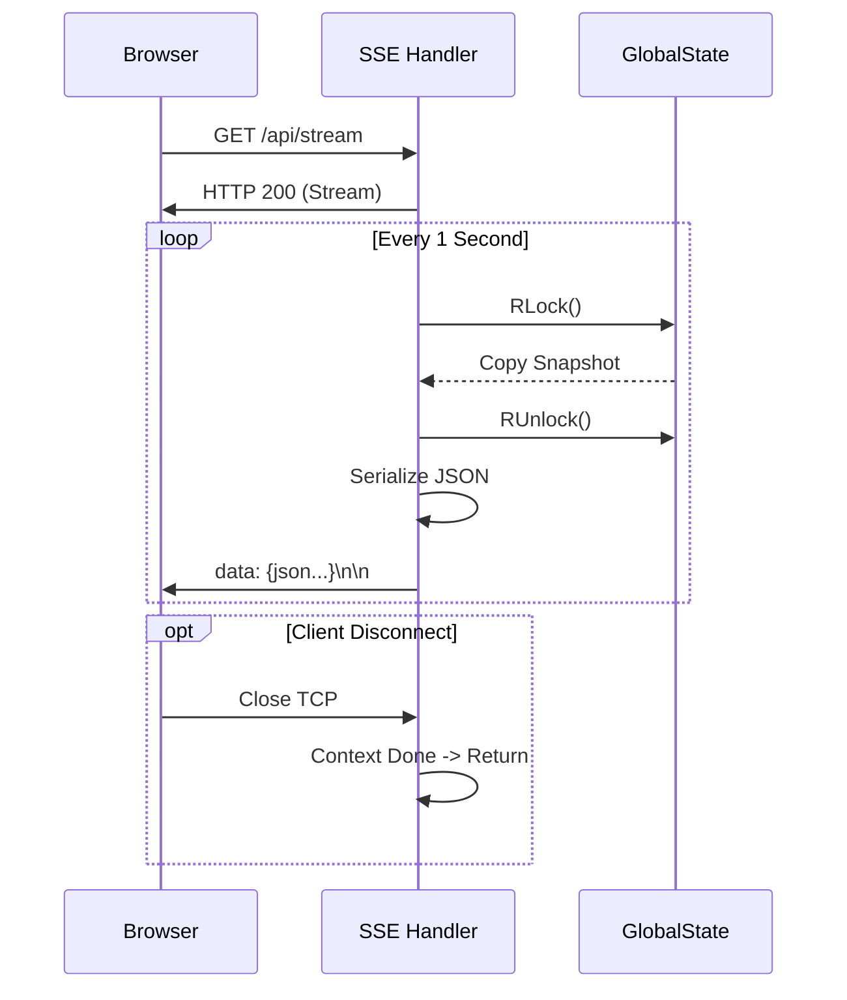

# 系统监控平台架构设计说明书 (System Architecture Design Document)

**版本**: v1.0
**日期**: 2025-05-01
**状态**: 正式版

---

## 1. 引言 (Introduction)

### 1.1 项目背景
在现代化 IT 基础设施中，服务器的实时状态监控是保障服务高可用的基石。传统的监控解决方案（如 Prometheus + Grafana）虽然功能强大，但存在部署复杂、资源占用高、配置繁琐等痛点。对于中小规模集群或单机环境，开发人员急需一款**轻量级**、**零依赖**、**开箱即用**的实时监控系统。

### 1.2 设计目标
*   **实时性**: 实现秒级的数据采集与前端推送（延迟 < 1s）。
*   **轻量级**: 无需安装 MySQL、Redis 等外部组件，单一二进制文件即可运行。
*   **可视化**: 提供直观的仪表盘、流量波形图、热力地图和网络拓扑图。
*   **容器友好**: 完美支持 Docker 容器化部署，能穿透隔离监控宿主机。

---

## 2. 系统总体架构 (System Architecture)

本项目采用 **B/S (Browser/Server) 架构**，后端负责高性能数据采集与分发，前端负责可视化渲染。

### 2.1 逻辑架构图
```mermaid
graph TD
    subgraph Client [前端 (Vue 3 + ECharts)]
        Dashboard[仪表盘组件]
        Topology[拓扑图组件]
        SSE_Client[SSE 客户端]
    end

    subgraph Server [后端 (Golang + Gin)]
        API_Layer[接口层 (Gin)]
        subgraph Core_Services
            Collector[采集引擎 (Goroutine)]
            Scanner[局域网扫描器 (GMP)]
            Auditor[网络审计 (GeoIP)]
        end
        subgraph Storage [内存存储 (In-Memory)]
            Global_State[DashboardData (RWMutex)]
            Ring_Buffer[日志环形缓冲]
        end
    end

    subgraph Infrastructure [底层资源]
        ProcFS[/proc 文件系统]
        Syscall[Windows API]
        NetInterface[网络接口]
    end

    Dashboard -->|HTTP GET| API_Layer
    SSE_Client <-->|SSE Stream| API_Layer
    Collector -->|Read| ProcFS
    Collector -->|Write| Global_State
    API_Layer -->|Read| Global_State
    Scanner -->|ICMP/TCP| Infrastructure
```

### 2.2 技术选型决策
| 模块 | 选型 | 决策理由 |
| :--- | :--- | :--- |
| **开发语言** | Golang (1.23+) | 原生并发支持 (Goroutine) 适合高频采集；静态编译部署方便。 |
| **Web 框架** | Gin | 基于 Radix Tree 路由的高性能 Web 框架；原生支持 SSE。 |
| **数据通信** | SSE (Server-Sent Events) | 相比 WebSocket 更轻量，完美契合"服务端单向推送"场景，自带断线重连。 |
| **采集库** | Gopsutil | 屏蔽了 Linux/Windows 系统差异，提供统一的指标获取接口。 |
| **前端框架** | Vue 3 + Vite | 响应式性能优异；Composition API 利于逻辑复用。 |
| **图表库** | ECharts 5 | 渲染性能强，支持 Canvas/SVG，适合动态波形和复杂拓扑图。 |

### 2.3 系统全链路数据流向图 (System End-to-End Data Flow)

以下是系统的详细数据流向图，展示了数据从底层采集到前端渲染的全过程（Graphviz DOT 源码）：

```dot
digraph SystemDataFlow {
    // 画布设置：白底黑字，避免深色背景
    bgcolor="white";
    rankdir=LR;
    node [shape=box, style="filled,rounded", fontname="Microsoft YaHei", fontsize=10, fillcolor="white", fontcolor="black", color="#333333"];
    edge [fontname="Microsoft YaHei", fontsize=9, fontcolor="#333333", color="#333333"];

    // 1. 基础设施层
    subgraph cluster_Infra {
        label="基础设施 (Infrastructure)";
        style="dashed";
        color="#999999";
        bgcolor="#fafafa"; // 极浅灰，接近白色
        
        ProcFS [shape=cylinder, label="/proc & Syscalls\n(系统指标)"];
        NetIf [shape=note, label="Network Interfaces\n(网络接口)"];
        LAN_Net [shape=cloud, label="Local Network\n(局域网)"];
        GeoDB [shape=cylinder, label="GeoLite2 DB\n(文件数据库)"];
    }

    // 2. 后端层
    subgraph cluster_Backend {
        label="后端服务 (Backend)";
        style="solid";
        color="#cccccc";
        bgcolor="#f5f5f5"; // 浅灰背景
        
        // 采集组件
        subgraph cluster_Workers {
            label="工作进程";
            style=invis;
            Collector [label="Collector Service\n(每秒采集)", fillcolor="#e3f2fd"]; // 浅蓝
            Auditor [label="Network Auditor\n(安全审计)", fillcolor="#e3f2fd"];
            Scanner [label="LAN Scanner\n(并发扫描)", fillcolor="#e3f2fd"];
        }

        // 内存存储
        GlobalState [shape=record, label="{ <data> DashboardData (Global) | { <cpu> CPU/Mem/Disk | <net> NetLog (Ring Buffer) | <topo> Topology Cache } }", fillcolor="#ffebee"]; // 浅红

        // 接口层
        SSE_Handler [label="SSE Handler\n(/api/stream)", fillcolor="#e8f5e9"]; // 浅绿
        API_Handler [label="API Handler\n(/api/lan, /api/alerts)", fillcolor="#e8f5e9"];
    }

    // 3. 前端层
    subgraph cluster_Frontend {
        label="前端应用 (Client)";
        style="solid";
        color="#cccccc";
        bgcolor="#fffde7"; // 浅黄
        
        Browser [label="Vue 3 SPA\n(ECharts 渲染)", fillcolor="#fff9c4"];
    }

    // --- 数据流向定义 ---

    // 采集流
    ProcFS -> Collector [label="读取指标"];
    NetIf -> Auditor [label="抓取连接"];
    LAN_Net -> Scanner [label="ICMP/TCP 探测"];
    GeoDB -> Auditor [label="IP 地理映射"];

    // 写入流 (加锁)
    Collector -> GlobalState:cpu [label="写入 Latest (Lock)", color="#d32f2f", fontcolor="#d32f2f"];
    Auditor -> GlobalState:net [label="追加日志 (Lock)", color="#d32f2f", fontcolor="#d32f2f"];
    Scanner -> GlobalState:topo [label="更新缓存 (Lock)", color="#d32f2f", fontcolor="#d32f2f"];

    // 读取流 (SSE)
    GlobalState:data -> SSE_Handler [label="读取快照 (RLock)", style=dashed, color="#1565c0", fontcolor="#1565c0"];
    SSE_Handler -> Browser [label="Stream Push\n(JSON)", penwidth=2, color="#2e7d32", fontcolor="#2e7d32"];

    // 读取流 (API)
    Browser -> API_Handler [label="HTTP Request"];
    GlobalState:topo -> API_Handler [label="读取拓扑"];
    API_Handler -> Browser [label="HTTP Response"];
}
```



---

## 3. 核心部件详解 (Core Components Specification)

本章节按系统重要性对核心部件进行拆解，明确其内部构造与交互逻辑。

### 3.1 采集引擎 (Collector Engine) —— [系统心脏]

负责周期性地从操作系统内核获取原始指标，并将其标准化为前端可渲染的数据结构。

*   **功能描述**: 
    *   **多维采集**: 覆盖 CPU、内存、磁盘 IO、网络流量、进程状态等 5 大类指标。
    *   **速率计算**: 自动计算两次采集周期内的差值，得出瞬时速率（如 `KB/s`）。
    *   **容器穿透**: 在 Docker 环境下，通过环境变量重定向自动挂载宿主机 `/proc` 文件系统。
*   **组成要素 (Components)**:
    *   `MetricFetcher` (指标获取器): 基于 `gopsutil` 屏蔽 OS 差异。
    *   `RateCalculator` (速率计算器): 维护 `LastState`，计算 `(Current - Last) / TimeDelta`。
    *   `Normalizer` (数据标准化器): 将原始 `uint64` 转换为人性化单位（%、GB）。
*   **依赖关系**: 
    *   OS Kernel (`/proc`, Syscalls)
    *   Golang Runtime
*   **输入/输出**:
    *   **Input**: 操作系统原始信号 (Raw Signals, `/proc/stat`, `/proc/meminfo`)
    *   **Output**: 标准化监控对象 (`struct DashboardData`)
*   **性能指标**:
    *   采集频率: 1 Hz (每秒一次)
    *   CPU 占用: < 0.5% (单核)
    *   耗时: < 10ms / cycle

**部件组成图 (Component Diagram)**:



### 3.2 局域网扫描器 (LAN Scanner) —— [环境感知]

负责主动探测当前网络环境，构建网络拓扑结构。

*   **功能描述**:
    *   **子网探测**: 自动识别本机 IP 和子网掩码，计算网段范围（如 `192.168.1.0/24`）。
    *   **存活检测**: 通过 ICMP Echo Request (Ping) 识别在线设备。
    *   **服务发现**: 探测特定端口（如 8041），识别是否安装了监控 Agent。
*   **组成要素 (Components)**:
    *   `IPGenerator` (地址生成器): 解析 CIDR，生成待扫描 IP 列表。
    *   `WorkerPool` (并发工作池): 基于 Channel 的信号量机制 (Semaphore)，限制并发数。
    *   `Pinger` (ICMP 探测器): 执行 Ping 操作。
    *   `PortScanner` (端口检测器): 执行 TCP Connect。
*   **依赖关系**: 
    *   网络接口 (NIC)
    *   ICMP 协议权限 (部分系统需 Root)
*   **输入/输出**:
    *   **Input**: 本机 IP 配置 (`net.Interface`)
    *   **Output**: 网络拓扑列表 (`[]TopologyNode`)
*   **性能指标**:
    *   并发度: 50 Workers
    *   扫描速度: < 3s (扫描 254 个 IP)
    *   缓存时效: 60s

**部件组成图 (Component Diagram)**:

```mermaid
graph TD
    subgraph Input [输入]
        CIDR[/"网段 CIDR (e.g. 192.168.1.0/24)"/]
    end

    subgraph Scanner [扫描器核心]
        Gen[IP 生成器]
        Sem[信号量 (Limit 50)]
        
        subgraph Workers [并发工作组]
            W1[Worker 1]
            W2[Worker 2]
            Wn[Worker N...]
        end
        
        Agg[结果聚合器]
    end

    subgraph Output [输出]
        Cache[("拓扑缓存")]
    end

    CIDR --> Gen
    Gen --> Sem
    Sem --> Workers
    Workers -->|Ping/TCP| Network((局域网))
    Workers --> Agg
    Agg -->|Update| Cache
```

### 3.3 内存状态库 (In-Memory Storage) —— [数据枢纽]

系统的核心数据交换中心，所有组件围绕其进行协作。

*   **功能描述**:
    *   **中心化存储**: 统一存放 CPU、内存、日志、拓扑等所有运行时数据。
    *   **并发控制**: 通过 `sync.RWMutex` 协调采集协程（写）与 API 协程（读）的竞争。
    *   **环形缓冲**: 针对日志数据实现定长队列，自动丢弃旧数据，防止内存溢出。
*   **组成要素 (Components)**:
    *   `LatestState` (最新快照): 存放最近一次采集的系统指标。
    *   `RingBuffer` (环形队列): `[]NetLogEntry`, `[]AlertInfo`。
    *   `RWMutex` (读写锁): 保护临界区。
*   **依赖关系**: 无 (纯内存操作)
*   **输入/输出**:
    *   **Input**: 各 Worker 的更新请求 (Write)
    *   **Output**: 任意时刻的系统快照 (Read)
*   **性能指标**:
    *   读写延迟: < 1µs
    *   内存占用: < 50MB (典型值)

**部件组成图 (Component Diagram)**:



### 3.4 实时推送网关 (SSE Gateway) —— [对外接口]

负责维持与前端的长连接，并实时推送数据流。

*   **功能描述**:
    *   **连接管理**: 维护客户端的 HTTP 长连接。
    *   **时序推送**: 配合 `time.Ticker` 每秒抓取最新状态并推送。
    *   **异常熔断**: 监测连接断开 (`Context.Done`)，自动释放资源。
*   **组成要素 (Components)**:
    *   `ConnectionHandler` (连接处理器): 建立 SSE 会话。
    *   `SnapshotReader` (快照读取器): 从内存库获取数据。
    *   `Serializer` (序列化器): Struct -> JSON。
*   **依赖关系**: 
    *   Gin Context
    *   GlobalState
*   **输入/输出**:
    *   **Input**: `GlobalState` 内存对象
    *   **Output**: `text/event-stream` (JSON String)
*   **性能指标**:
    *   推送延迟: < 10ms
    *   并发支持: 取决于文件句柄限制 (ulimit)

**部件组成图 (Component Diagram)**:



---

---

## 4. 数据结构设计 (Data Structures)

### 4.1 全局监控对象 (`DashboardData`)
```go
type DashboardData struct {
    CPU       CPUInfo       `json:"cpu"`
    Memory    MemoryInfo    `json:"memory"`
    Disk      []DiskInfo    `json:"disk"`
    Network   []NetworkInfo `json:"network"`
    System    SystemInfo    `json:"system"`
    Perf      PerfInfo      `json:"perf"`         // 性能概览
    NetLog    []NetLogEntry `json:"net_log"`      // 网络流量审计日志
    GeoHeat   []GeoPoint    `json:"geo_heat"`     // 地理热力分布
    Timestamp int64         `json:"timestamp"`
}
```

### 4.2 存储策略
*   **内存驻留**: 所有数据均为易失性存储 (Volatile)，重启即重置。
*   **环形缓冲 (Ring Buffer)**:
    *   `NetLog` 和 `AlertLog` 采用切片模拟环形缓冲。
    *   当 `len(log) > MaxSize` 时，执行 `log = log[len-MaxSize:]`，防止内存无限增长。
*   **GeoIP 数据库**:
    *   文件: `GeoLite2-City.mmdb`
    *   模式: 只读加载 (Memory Mapped)，查询速度快。

---

## 5. 接口详细定义 (Interface Specifications)

系统接口分为对外提供的用户接口 (API)、内部模块间调用的内部接口、以及与底层系统交互的外部接口。

### 5.1 用户接口 (User Interfaces / HTTP API)

前端应用与后端服务交互的唯一通道。

**设计风格**: 采用 **RPC-style HTTP 接口**，而非严格的 RESTful 风格。主要通过 `GET` 方法获取聚合数据或触发操作，优先保障实时性与开发便捷性。

| 接口类型 | 方法 | URL 路径 | 请求参数 | 响应结构 (JSON) | 描述 |
| :--- | :--- | :--- | :--- | :--- | :--- |
| **实时流** | `GET` | `/api/stream` | 无 | `event: dashboard`<br>`data: {...}` | **SSE 长连接**。每秒推送一次 `DashboardData` 全量快照。支持断线自动重连。 |
| **仪表盘** | `GET` | `/api/dashboard` | 无 | `DashboardData` | 获取当前时刻的单次快照，用于页面初始化或 SSE 失败降级。 |
| **拓扑图** | `GET` | `/api/lan` | 无 | `ScanResult` | 获取局域网扫描结果。后端有 60s 缓存，若缓存失效则触发异步扫描并返回旧数据。 |
| **告警日志** | `GET` | `/api/alerts` | `limit` (int, def:20)<br>`offset` (int, def:0) | `{ items: [], total: N }` | 分页查询历史告警记录。 |

> **注**: 本项目暂无 `POST/PUT/DELETE` 接口。所有系统配置（如采集频率、端口号）均通过环境变量或启动参数注入，而非通过 API 运行时修改，以保证监控服务的安全性与稳定性。

### 5.2 内部模块交互约定 (Internal Module Interactions)

本项目为单体架构 (Monolithic)，不存在微服务间的 RPC 接口。所谓的“内部接口”特指**Golang 包 (Package) 之间的导出函数与共享数据契约**。

#### 5.2.1 跨包函数调用 (Function Contracts)
*   **采集驱动**: `metrics.StartCollector()`
    *   **定义**: `package metrics` -> `func StartCollector()`
    *   **契约**: 调用即启动后台 Goroutine，无需返回值。由 `main` 包在启动时触发。
*   **告警查询**: `metrics.GetAlerts(limit, offset int) ([]AlertInfo, int)`
    *   **定义**: `package metrics` -> `func GetAlerts(...)`
    *   **契约**: 线程安全地读取历史告警切片，支持分页逻辑。
*   **拓扑查询**: `lan.GetTopology()`
    *   **定义**: `package lan` -> `func GetTopology() ScanResult`
    *   **契约**: 同步返回 `ScanResult` 结构体。内部封装了“缓存检查 -> 异步扫描 -> 返回旧值”的复杂逻辑，对调用方透明。

#### 5.2.2 共享内存数据总线 (Shared Memory Bus)
系统采用**共享内存通信**模式，而非 CSP (Channel) 模式。`metrics` 包导出的全局变量构成了实质上的数据交换接口。

*   **数据源**: `var Latest DashboardData` (由 `Collector` 写入)
*   **同步锁**: `var Mu sync.RWMutex` (写入方持写锁，读取方持读锁)
*   **契约**: 任何模块读取 `Latest` 前**必须**先获取 `Mu.RLock`，否则视为非法调用，可能导致 Race Condition。

### 5.3 外部接口 (External Interfaces)

后端服务与操作系统底层及外部环境的交互界面。

| 交互对象 | 接口形式 | 关键技术 / 库 | 描述 |
| :--- | :--- | :--- | :--- |
| **OS Kernel** | Syscalls / Filesystem | `gopsutil` | 读取 `/proc/stat` (CPU), `/proc/meminfo` (Mem) 等文件；调用 Windows API 获取系统信息。 |
| **Container** | Environment Variables | `os.Getenv` | 读取 `HOST_PROC` 环境变量，重定向采集路径以穿透 Docker 容器。 |
| **Network** | Socket (ICMP/TCP) | `net` 标准库 | 发送 ICMP Echo Request (Ping)；尝试 TCP Connect 连接目标端口 8041。 |
| **GeoIP DB** | File I/O | `geoip2-golang` | 内存映射读取 `GeoLite2-City.mmdb` 文件，将 IP 地址转换为经纬度坐标。 |

---

## 6. 关键技术难点与解决方案 (Challenges & Solutions)

### 6.1 难点一：高并发与资源限制的平衡
*   **场景**: 局域网扫描涉及大量网络 IO。
*   **解法**: 引入 **信号量 (Semaphore)** 模式。通过带缓冲的 Channel 限制最大并发 Goroutine 数量为 50，既保证了扫描速度（秒级完成 /24 网段），又避免了 `Too many open files` 错误。

### 6.2 难点二：容器隔离环境下的宿主机监控
*   **场景**: Docker 容器内只能看到自己的 Namespace 资源。
*   **解法**: **Host Path Mapping**。
    *   Docker 启动参数: `-v /proc:/host/proc -e HOST_PROC=/host/proc`
    *   代码逻辑: `gopsutil` 库支持通过环境变量重定向读取路径，从而穿透容器边界读取物理机指标。

### 6.3 难点三：实时大屏的渲染性能
*   **场景**: 前端每秒接收大量数据，全量重绘会导致浏览器卡顿。
*   **解法**: **增量渲染 + 响应式代理**。
    *   后端仅推送当前快照。
    *   前端利用 Vue 3 `reactive` 对象只更新变化字段。
    *   ECharts 开启 `merge: true` 模式，仅重绘数据点变化的图层，而非销毁重建。

---

## 7. 部署视图 (Deployment)

### 7.1 Docker 部署
```bash
docker run -d \
  --name system-monitor \
  --network host \
  -v /proc:/host/proc:ro \
  -v /sys:/host/sys:ro \
  -e HOST_PROC=/host/proc \
  -e HOST_SYS=/host/sys \
  system-monitor:latest
```
*   **--network host**: 必须使用 Host 模式，否则无法扫描局域网其他设备，且无法监控宿主机网络流量。
*   **Volume 挂载**: 将宿主机关键系统目录挂载为只读，确保数据采集准确性。
